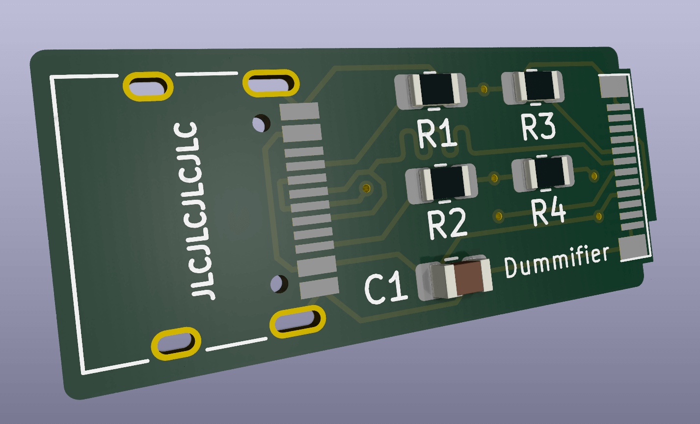
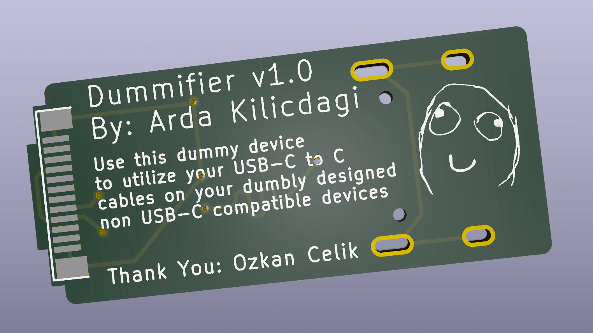

# Dummifier
Dummifier: A USB-3 to USB-2 with USB Type-C Port adapter where the the engineers fail to follow basic standards while designing the boards.

You just plug this dongle thingy between your device and your usb-c cable, and it'll start working as you expected.

# Why?

First of all, I needed this. Some devices that I own, such as [Planck keyboard](https://drop.com/buy/planck-mechanical-keyboard), [Anbernic RG351P](https://retrogamecorps.com/rg351/) utilized USB-C port, but they only worked when a cheap USB-C to USB-A cable was utilized, or through a USB Hub. They were not working at all with the USB-C cable I carry around, or getting wrong voltage and being burned. I burned my GP micro USB (I was using a USB-C to micro USB converter) battery charger because of this.

Additionally, I made some mods for Nintendo new 2DS XL for USB-C mod, and some cables were not working correctly.

Even newer Raspberry Pi Pico clones were having this issue.

The common workaround for this issue is using a USB Hub, or Cheap, non-standard, USB 2.0 Type A to USB-C 4 pin cables.

These cables are getting harder to find day by day.

I used to make some dummy cables for this purpose. Like [this](https://twitter.com/ardadev/status/1750195780932063600), [this](https://www.reddit.com/r/3DS/comments/whqvg9/made_a_usbc_converter_cable_that_works_with_usbc/) and [this](https://www.reddit.com/r/vitahacks/comments/uyd8oe/created_a_typec_adapter_for_my_vita_1000_that/). Functionality wise, they were all working, but damn they were ugly! Also, they had one thing in common. These populated 5.1K ohm resistors in CC1 and CC2 pins.

When I checked the [USB standards](https://www.usb.org/sites/default/files/USB%20Type-C%20Spec%20R2.0%20-%20August%202019.pdf) (page 38 and 76) , I realized these were necessary on female end so that the devices could talk to each other with USB 2.0 standards and get 5V instead of PD voltages.

After I burned my GP battery charger, I decided to tinker with Kicad and make my own adapter.

Some people even suggest using a [flex PCB mod that's soldered directly over the connector](https://github.com/ide/usb-c-to-c-power-mod) of these crappy designed devices, but this is not doable by everyone.

So, I decided I'd make a little converter like this. Anyone could use this. It's like a USB-C extension cable that you plug the male end to the bad device, and the female end to your favorite modern USB-C to USB-C cable.

I hope someone finds this helpful.

## Current status

* Tested, works nicely! Utilize only 5.1k resistors and 100nf cap (cap is optional). [Part from my Twitter flood, here](https://twitter.com/ardadev/status/1767934961703702860)
* Also, please be aware of the license of the project.

# Requirements

* Kicad 8
* If not set already, from PCB editor:
	* go to File / Board Setup
	* Set "Copper to Edge Clearance" to 0 (zero)

# TODOs

* Make VCC and GND lanes thicker.
* Export Gerber files directly for factory-ready printing.

# Special Thanks

* [Ozkan Celik](https://github.com/ozkan). He helped me a lot during the design process and ideas.
* Ender Piyale, I gave him a lot of headache as well.

# License
GNU GPL V3
